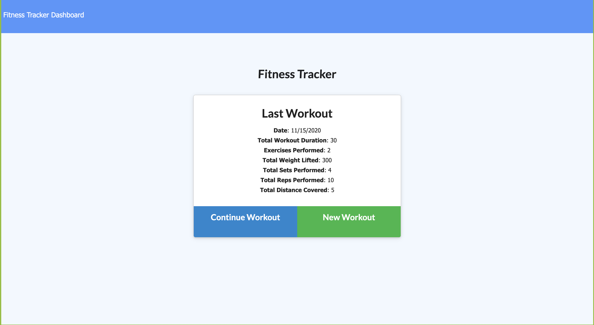

# fitnessTracker

## Description
Using mongoose to manage my database and javascript, I created an application where users can view and save workouts. They can add to their previous workout, or start a new one, as well as view the stats of their workouts.

## Table of Contents
* [Installation](#installation)
* [Usage](#usage)
* [Questions](#questions)

## Installation
Run npm install after getting the code to get the necessary node modules installed.

## Usage
Run npm run start to open the server locally.

## Deployed Application
https://arcane-cliffs-79697.herokuapp.com/

## Questions
<a href="https://github.com/tmessall">Github</a>

Email me at tmessall17@gmail.com with any further questions.
